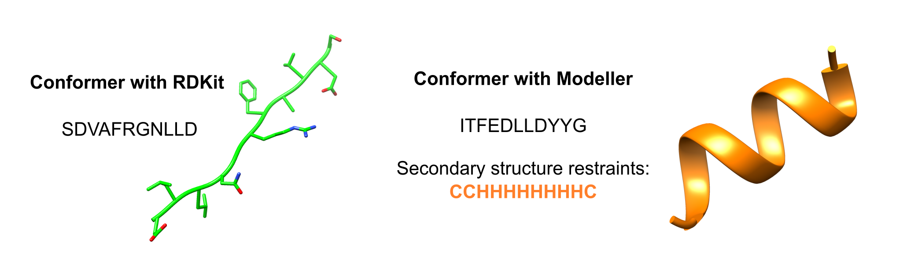
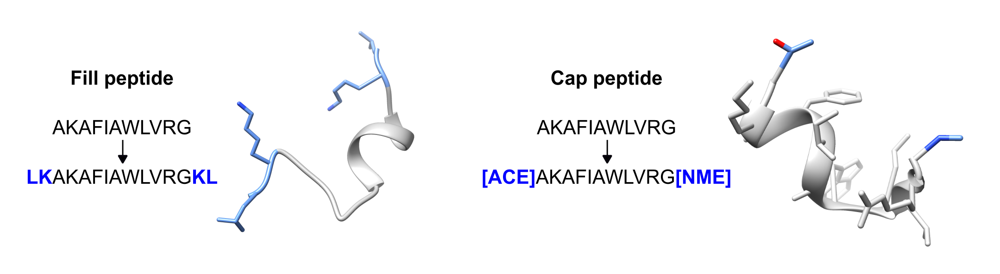
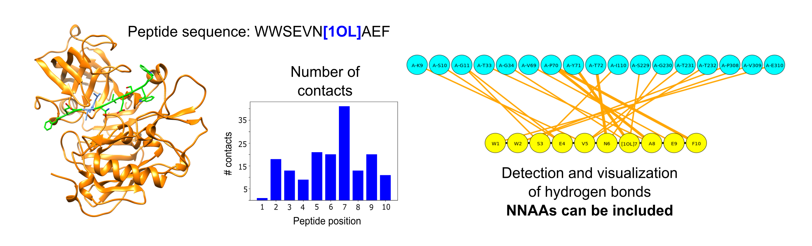
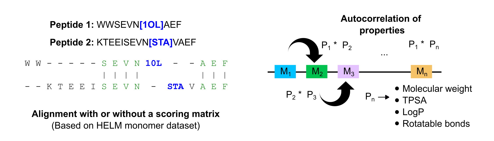

# PepFun 2.0

## Open protocols for peptide analysis

* From publication "PepFun 2.0: improved protocols for the analysis of natural and modified peptides"
* Author: Rodrigo Ochoa

## Purpose

Here we present PepFun2.0, a package for the analysis of natural and modified peptides using a set of modules to study the sequence and structure of the molecules. The python package is composed of five main modules to run different tasks such as sequence alignments, prediction of properties, generation of conformers, modification of structures, detection of protein-peptide interactions, and extra functions to include non-natural amino acids in the analysis.

## Required third-party tools

The package relies on RDKit (https://rdkit.org/), BioPython (https://biopython.org/) and Modeller packages. These can be installed using a Conda environment. The other packages and PepFun can be installed using the the `setup.py` file. A clear and quick installation guide is shown in the next section.

## Quick installation

We recommend to create a conda environment where the main packages can be installed using the following command:
```Bash
conda create -c rdkit -c salilab -n pepfun2.0 rdkit biopython modeller pycairo
```

To activate the environment you can use the command:

`conda activate pepfun2.0`

**NOTE 1**: After installing Modeller, add the academic license key in the suggested file. The license can be acquired at the Modeller website: https://salilab.org/modeller/registration.html

Now in the environment, PepFun and the remaining packages can be easilly installed using the `setup.py` with:
```Bash
python setup.py install
```

PepFun can be run using the modules directly in a python script. Examples are provided in the next section.

**NOTE 2**: If a simple analysis is required using a command line interface, the original version of PepFun can be used with some of the functions included in this version: https://github.com/rochoa85/PepFun

## How to run it

### 1. Sequence module

The first thing is to import the modules:

```Python
# PepFun modules
from pepfun.sequence import Sequence
from pepfun.sequence import Library
```

For this module the input is a peptide sequence, which is required to create the object:

```Python
sequence = "KMGRLFR"
pep = Sequence(sequence)
print("The main peptide sequence is: {}".format(pep.sequence))
```

From there we can calculate different properties using the sequence or the RDKit molecular object:

```Python
# Sequence tables
pep.compute_peptide_charges()
print("Net charge at pH 7: {}".format(pep.netCharge))

pep.calculate_properties_from_sequence()
print("Average Hydrophobicity: {}".format(pep.avg_hydro))
print("Isoelectric Point: {}".format(pep.isoelectric_point))

# RDKit descriptors
pep.calculate_properties_from_mol()
print("Molecular weight: {}".format(pep.mol_weight))
```

The sequence used to create the object can be compared to others by similarity matrices or using SMILES representations:

```Python
# Using a similarity matrix
pep.align_position_matrix("KAGRSFR")
print("Alignment score by position with peptide KAGRSFR is: {}".format(pep.score_matrix))

# Counting matches
pep.align_position_local("KAGRSFR")
print("The number of dismatches with peptide KAGRSFR are: {}".format(pep.dismatch))

# Using the SMILES and fingerprint similarity
pep.similar_smiles("KAGRSFR")
print("The SMILES similarity is: {}".format(pep.smiles_similarity))
```

In addition, a Library module can be used to generate peptide libraries under certain conditions:

```Python
# Create a library with only 3 AAs and a size of 3
lib=Library(3,list_aa=['A','L','S'])
frags=lib.generate_sequences()
print("List of generated fragments:",frags)

# Create a library with all natural AAs and a size of 4 and frequency of 3 AAs per position
lib = Library(4)
peptides=lib.combinatorial_library(3)
print("List of generated peptides",peptides)
```
### 2. Conformer module

Here we can predict a sequence conformer using two methodologies. First we import the modules:

```Python
# PepFun modules
from pepfun.conformer import Conformer
```

Then we can create the object using a sequence as input. 

**NOTE 3:** Something important is to provide the path of the auxiliar folder depending where of its in the system. The folder is included in the code.

```Python
# The auxiliar path folder can be changed depending on your system
sequence = "KMGRLFR"
pep = Conformer(sequence, auxiliar_path="../auxiliar")
```

After this, we can generate the conformer using the ETKDG methodology from RDKit:

```Python
# Generate a PDB file with the conformer
pep.generate_conformer()
```

Another methodology is to predict the secondary structure of the peptide using PSIPRED, and then include the restrictions in the Modeller package as follows:

```Python
# Predict the secondary structure
ss=pep.run_psipred()
# Generate the peptide templates, as well as the secondary structure restrictions
pepT, pepM, rangeHelix, rangeBeta, rangeCycle = pep.prepare_modeller(ss)
# Run Modeller
pep.modelling_modeller(pepT, pepM, rangeHelix, rangeBeta, rangeCycle)
```
    
A graphical example of both options is shown in the following figure:



### 3. Modifications module

In this module different modifications can be done on existing peptide structures. This is possible for the peptide alone or in complex with a protein target. First we import the modules:

```Python
from pepfun.modifications import Filling
from pepfun.modifications import Capping
from pepfun.modifications import Mutation
```

The first example is the filling of a single peptide by adding flanking amino acids. For this, the module requires the peptide sequences (template and model) and the PDB code of the file having the peptide structure  (without the pdb extension). Please check the location of the PDB input file to avoid errors.

```Python
# Provide the template sequence and the sequence with the new amino acids
template="AKAFIAWLVRG"
model="LKAKAFIAWLVRGKL"
# The function accepts as input the peptide sequences and the code of the PDB file
code = "peptide_alone"
Filling.fill_peptide_alone(code,template,model)
```

The same can be reproduced for the peptide in complex with a protein target:

```Python
# Template and sequence to be model
template="PTSYAGDDS"
model="AAPTSYALGDDSAA"
# Code of the complex and function to fill the remaining amino acids
code="peptide_complex"
Filling.fill_peptide_complex(code,template,model)
```

For capping a peptide, both the sequence and the PDB file (with extension) should be provided, together with the modality that allows capping any of the flanking parts, or both. By default the N-term is capped with ACE, and the C-term with NME:

```Python
# Peptide template that should be the same in the PDB file
peptide="AKAFIAWLVRG"
# Calling the function with the pdb file and the mode to cap
pdb_file="peptide_alone.pdb"
Capping.capping_peptide(pdb_file,peptide,mode='N-term')
```

A graphical example for the filling and capping functionalities is shown in the following figure:



The final function is the mutation, which allows the replacement of an amino acid by a non-natural monomer (NNAA). For this is relevant to have a PDB file of the monomer that will be included in the structure, as well as other parameters:

```Python
# Path to the input structure
pdb_file = "../auxiliar/example_structure.pdb"
# Chain of the peptide in the structure
chainID = "C"
# Position that will be mutated
pepPosition = 2
# PDB of the NNAA that will be included
pdbNNAA = "../auxiliar/Aib.pdb"
# Chain of the NNAA in the PDB file
chainNNAA = "A"
# 3-letter code of the NNAA
nnaa_name = "AIB"
```

Then the following functions should be called to do the mutation:

```Python
# Call the function with the input variables
mut = Mutation(pdb_file, chainID, pepPosition, pdbNNAA, chainNNAA, nnaa_name)
# Get the backbone dihedrals from the reference structure
mut.get_bb_dihedral()
# Get dictionary with bond, angle and dihedral information
mut.get_NNAA_basic_info()
# Generate the PDB file with the mutation
mut.assign_mutation()
```

### 4. Interactions module

For this module, a protein-peptide complex can be provided to detect different type of interactions. In addition, a function to map secondary structure elements of the peptide is included. First we import the module:

```Python
from pepfun.interactions import Interactions
```

Then we have to define the input variables, including the PDB of the complex, the conformation type of the peptide (linear or cyclic), the contact threshold and the path to the auxiliary folder provided in the code.

```Python
# PDB file of the complex
pdb_file = "../auxiliar/example_structure.pdb"
# Chain of the peptide
chain = "C"
# Path to the auxiliar folder
aux_path = "../auxiliar"
# Type of peptide conformation (linear or cyclic)
pep_conformation = "linear"
# Distance threshold to define contacts
contact_threshold = 4.0
```

Then we can define the object and extract basic information of the peptide such as its sequence or secondary structure:

```Python
pepStr = Interactions(pdb_file, chain, auxiliar_path=aux_path)
print("Peptide sequence based on the PDB file is: {}".format(pepStr.sequence))

pepStr.get_secondary_structure()
print("The predicted secondary structure is: {}".format(pepStr.total_dssp))
```

Then we can detect the hydrogen bonds between the peptide and the protein, plot them using a graph-based figure and count the number of contacts based on the defined threshold:

```Python
# Functions to detect the different types of interactions
pepStr.get_hydrogen_bonds()
pepStr.plot_hydrogen_bonds(pep_conformation)
pepStr.get_heavy_atom_contacts(contact_threshold)

print("The total number of contacts are: {}".format(pepStr.total_contacts))
print("The total number of hydrogen bonds are: {}".format(pepStr.number_hydrogen_bonds))
# Dictionary with the summary per peptide position, including accesible surface area values
print("The following are the details per amino acid in the peptide:")
print(pepStr.positions)
```

A graphical example of the interactions for a peptide having a NNAA is shown in the following figure:



### 5. Extra module

In the last module, different functions are included to align natural and modified peptides, generate amino acid-based descriptors for peptides with NNAAs, and a function to convert SMILES to peptides (available only for natural amino acids). First we import the modules:

```Python
from pepfun.extra import Alignment
from pepfun.extra import pepDescriptors

# Additional functions to convert SMILES to peptide
from pepfun.sequence import Sequence
from pepfun.extra import readProperties
from pepfun.extra import peptideFromSMILES
```

We can generate alignments between natural and modified peptides. For the natural, a function to obtain a similarity value is available:

```Python
similarity = Alignment.similarity_pair("KMGRLFR", "KAGRSFR")
print("The similarity between peptides KMGRLFR and KAGRSFR is: {}".format(similarity))
```

For modified peptides, the sequences should be provided in BILN format (separated by dashes), and the alignment can be weighted or not. The weights are based on a similarity matrix created for a dataset of HELM monomers available here: https://github.com/PistoiaHELM/HELMMonomerSets. Because of this, please verify that the monomers included in your sequences are part of the monomer dataset. Check the data folder to see the list of monomers available (monomers.csv).

```Python
score,start,end=Alignment.score_modified("K-Aib-M-P","S-Aib-Iva-P",mode="weighted")
print("The score between peptides K-Aib-M-P and S-Aib-Iva-P is: {}".format(score))
```

Also for modified peptides, a function to generate autocorrelation descriptors for machine learning models is provided. The sequence should be in BILN format, and a dictionary with a set of amino acid-based descriptors will be generated. For details please check the manuscript.

```Python
desc=pepDescriptors("K-Aib-Iva-P-L-C-D",generate_properties=False)
descriptors=desc.moranCorrelation()
print("Predicted AA-based descriptors",descriptors)
```
A graphical example of the alignment and the descriptors for modified peptides with NNAAs is shown in the following figure:



Finally an extra function is included to convert from SMILES to a peptide sequence based on the mapping of amino acid weights. For the example, we show how to generate the SMILES for the sequence 'PEPTIDE', and then how to use the SMILES to recover the initial sequence.

```Python
# Input sequence and generation of SMILES using the Sequence module of PepFun
seq_input="PEPTIDE"
seq = Sequence(seq_input + "G")
smiles = seq.smiles

# Reading monomer properties in a dataframe
df = readProperties()
# Generating the sequence with the SMILES and the dataframe
pep = peptideFromSMILES(smiles,df)
print("The mapped sequence is {}".format(pep))
```
## Tests

A set of unit tests are available in the `tests` folder. These can be run separately per module by calling each test script, or all can be tested at the same time using the `test.py` file.

```Bash
python test.py
```

## References

If you use PepFun in your work, please cite the following papers:

* 'PepFun: Open Source Protocols for Peptide-Related Computational Analysis', Molecules, 2021. Link: https://www.mdpi.com/1420-3049/26/6/1664
* 'PepFun 2.0: improved protocols for the analysis of natural and modified peptides'.

## Support

For inquiries please contact us at: rodrigo.ochoa@udea.edu.co.
